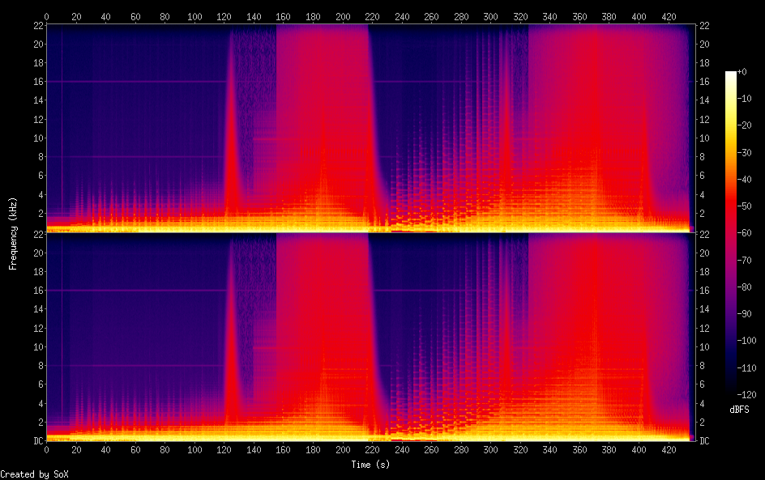
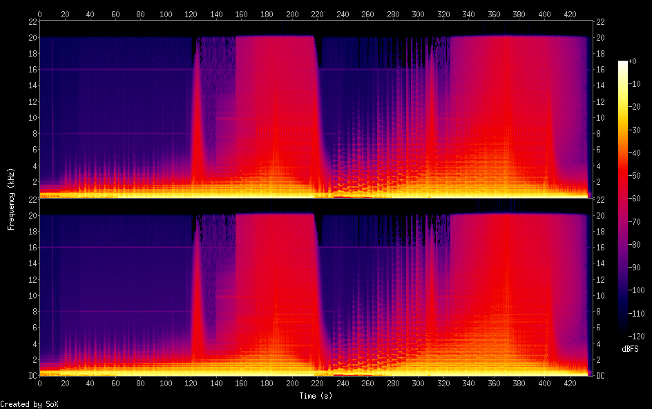

# Spectrogram analysis of different audio qualities

# Explanation
A lossless audio file captures all the frequencies audible to humans between 0 and 22 kHz. In the following picture this is indeed what you see. In particular, the spectrum between 20 and 22 kHz is fully captured.

A lossy audio file on the other hand erases the spectrum between 0 and 22 kHz as can be seen in the following picture.

Thus, a file re-encoded in a lossless format cannot retrieve the information stored in that slot. The following image shows the spectrum of a lossless file from a lossy file. It can be seen that the frequencies between 0 and 22 kHz could not be recovered.

## Side notes
The lower the bitrate of a file, the more high frequencies are suppressed.  The example above uses a lossy mp3 file at 320 Kbps as an example. This kind of format is considered to be of excellent quality even if 2000 Hz of data is removed.

## References
- The music used for this example is the track "Forrest Glade" by the artist Einmusik.
- The spectrograms were generated with the _sox_ terminal utility.